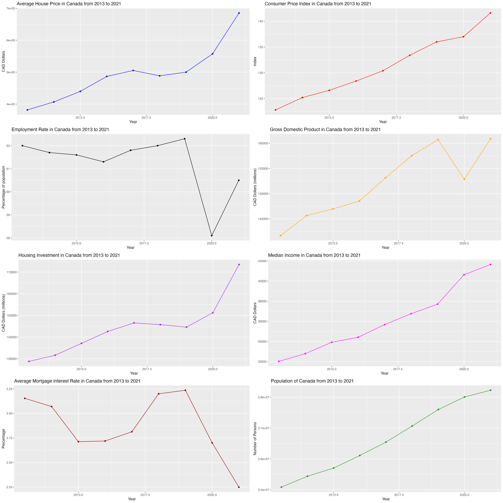

# Canadian Housing Market Analysis & Predictive Models

## Table of Contents
- [Introduction](#introduction)
- [Technologies](#technologies)
- [Setup](#setup)
- [Usage](#usage)
- [Features](#features)
- [Data Sources](#data-sources)
- [Analysis Overview](#analysis-overview)
- [License](#license)

## Introduction
This project presents an analysis of the housing market, aimed at uncovering the complex dynamics that influence property values. Using correlative data analytics techniques, we delve into various economic factors such as annual GDP, mortgage interest rates, CPI, and employment rates, to derive meaningful insights. Our objective is to provide a tool for stakeholders in the real estate sector, including investors, homebuyers, and policymakers, to make informed decisions.

## Technologies
This project is developed using R and several specialized packages:
* **RStudio:** The primary IDE for R programming, offering a user-friendly environment for data analysis and visualization.
* **Tidyverse:** An integrated collection of R packages designed for data science, making it easier to manipulate, visualize, and analyze data.
* **ggplot2:** A powerful system for creating visually appealing data visualizations.
* **randomForest:** For building random forest models, useful in predictive analytics.
* **glmnet:** Implements generalized linear and elastic-net regression models.
* **corrplot:** Visualizing correlation matrices, useful in understanding relationships between variables.

## Setup
Install and open RStudio and install the required packages:
```
install.packages(c("tidyverse", "ggplot2", "randomForest", "glmnet", "corrplot")) 
```

## Usage
Open the project in RStudio:
1. Load the necessary libraries:
```
library(tidyverse)
library(ggplot2)
library(randomForest)
library(glmnet)
library(corrplot)
```
2. Run the analysis scripts to reproduce the findings.

## Features
This project includes:
* **Data Exploration and Cleaning:** Using tidyverse for efficient data manipulation and preprocessing.
* **Correlation Analysis:** Utilizing corrplot to visualize the relationships between different housing market factors.
* **Statistical Modeling:** Building predictive models with randomForest and glmnet LASSO to forecast housing market trends.
* **Rich Data Visualizations:** Employing ggplot2 for creating compelling and informative visual representations of our findings.

## Data Sources
* [Consumer Price Index Data](https://www150.statcan.gc.ca/t1/tbl1/en/tv.action?pid=1810000501)
* [Employment Rate Data](https://www150.statcan.gc.ca/t1/tbl1/en/tv.action?pid=1410002001&pickMembers%5B0%5D=1.1&pickMembers%5B1%5D=2.10&pickMembers%5B2%5D=4.1&pickMembers%5B3%5D=5.1&cubeTimeFrame.startYear=2019&cubeTimeFrame.endYear=2023&referencePeriods=20190101%2C20230101)
* [GDP Data](https://www150.statcan.gc.ca/t1/tbl1/en/tv.action?pid=3610040101)
* [Housing Investment Data](https://www150.statcan.gc.ca/t1/tbl1/en/tv.action?pid=3610067701)
* [Median Income Data](https://www150.statcan.gc.ca/t1/tbl1/en/tv.action?pid=1110000801)
* [Mortgage Interest RateData](https://www150.statcan.gc.ca/t1/tbl1/en/tv.action?pid=1010000601)
* [Population Data](https://www150.statcan.gc.ca/t1/tbl1/en/tv.action?pid=1710000501)
* [Average House Price Data](https://www.crea.ca/housing-market-stats/canadian-housing-market-stats/)

## Analysis Overview
The analysis focuses on several key aspects:

* The effect of various economice factors on housing prices.
* Predictive modeling to forecast market trends.
* Visualizing complex data for easy interpretation and insights.


*Figure 1: Line plots of the economic factors from 2013 to 2021.*


*Figure 2: Correlation plot using `corrplot` to observe how the 8 economic factors are correlated to one another.*

The HTML version of the analysis, generated from the R Markdown file, is available in this repository. You can download it [here](correlation_analysis.html).

## License
This project is licensed under the MIT License - see the [LICENSE](LICENSE.md) file for details.

---

© 2024 [Shayla Tran]([Your-GitHub-Profile-Link](https://github.com/shaytran)https://github.com/shaytran)
